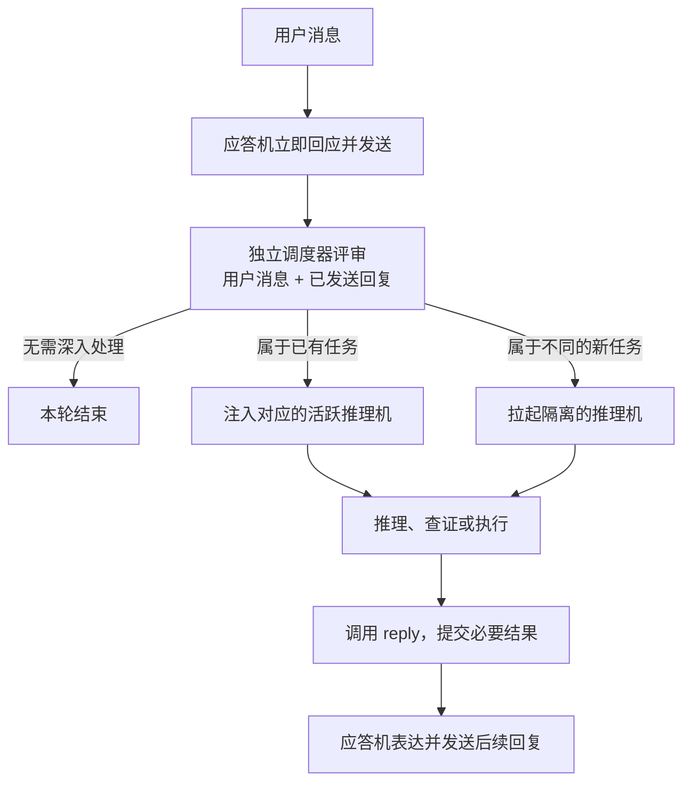

# project.md — 产品意图与刻意设计

> 本文档同时面向开发者和 AI Agent，是本项目产品意图与刻意设计的最高层说明。
> 在把现有行为判定为缺陷或改变用户可见行为之前，必须先对照本文档。
> 修复与本文意图明确不符的实现错误，不需要重新确认产品设计。

## 一、项目是什么

MSTD 是驻留在飞书（Lark）里的团队助理“小达”。它通过多模型协作感知群聊和
私聊消息，保持即时应答，在后台完成深入推理、资料查证和工具调用，并在服务端
审批门控下执行真实写操作。代码主体位于 `mstd-orchestrator/`。

项目追求的不是“让一个大模型包办所有事情”，而是把对话、判断和执行拆成职责
明确、可以独立演进的角色，同时让用户始终只感受到一个连贯的小达。

## 二、已接受的目标架构：应答机、独立调度器与任务级推理机

**状态：已接受（2026-07-14 定案）；代码已实现（legacy/shadow/active 三模式，由
`MSTD_AGENT_ARCHITECTURE_MODE` 控制）。2026-07-15 决定：切换 active 灰度上线，
先测试群、验证后放业务群。在此之前生产一直运行 legacy 路径。**

“快机/慢机”只是性能描述，不再作为长期架构边界。目标架构按职责划分为三个
角色；具体模型型号和降级链是可替换实现，不属于产品身份。

| 角色 | 产品职责 | 明确不负责 |
|---|---|---|
| 应答机（Responder） | 产品语义上始终在线；处理每条用户消息；维护 SOUL 人格；是唯一面向用户的声音 | 深度推理、长任务编排、独立决定自己是否需要被升级 |
| 独立调度器（Dispatcher） | 作为第三方评审，检查“用户消息＋应答机已给出的回复”；决定是否需要推理、消息属于哪个任务、复用还是新建推理实例 | 代表应答机请求帮助、生成用户文案、执行任务 |
| 推理机（Reasoner） | 在任务隔离的上下文中推理、查证、调用工具并形成决策；完成后把必要结果交回应答机 | 直接对用户说话、维护对外人格、与无关任务共享工作上下文 |

### 运行流程

关键语义：

- 应答机的第一条消息是真实回复，不只是占位 ack；不等待调度器和推理机。
  独答边界（2026-07-15 收紧定案）：身份、寒暄、对话中已有信息可以直接完整
  回答；凡涉及新事实、需要查证、需要工具或最新数据的问题，不得凭模型参数
  记忆直接作答，必须把事实交给推理机，并用自己的话自然说明要去核实——
  **禁止固定模板句**（"稳稳接住""我先处理一下"之外再造一批口头禅同样不可接受），
  语体细则待"AI 味语言"专项调研产出后定稿。
- 调度器在第一条消息已经发出后异步评审，因此不能阻塞应答机的即时响应。
- 调度器提示词必须把自己定义为独立第三方评审。不得告诉它“应答机请求升级”，
  避免用带倾向性的前提污染判断。
- 调度器评审的是任务是否还需要深入处理，不是“能否避免第二条回复”。
- `reply` 的目标语义是“把推理结果交回应答机表达”，而不是“推理机直接向用户
  出站”。应答机可以调整语气和组织方式，但不得篡改推理结论或编造新事实。

### 任务级隔离与并行

推理实例按任务而不是按会话隔离。同一飞书会话可以同时存在多个互不共享工作
上下文的推理任务：

- 新消息属于已有任务时，调度器把它作为补充或修正注入对应推理实例。
- 新消息属于不同任务时，调度器拉起新的推理实例，不把它塞进当前实例。
- 调度器必须维护消息、`task_id`、推理实例和后续回复之间的归属关系，防止不同
  事情的上下文杂糅，也防止旧结果回流到错误话题。
- 并行数量、取消/替代规则、超时和资源上限属于实现方案，落地前另行确认；不得
  默认为“一个会话永远只有一个推理机”。

### 两阶段回复与闭环

**双回复是刻意设计，不是天然缺陷。**“即时应答＋深入处理”是产品希望提供的
两阶段体验：应答机保持在线，推理机随后带回更完整的信息、查证结果或执行结果。

采用条件闭环（2026-07-14 定案）：

- 应答机明确承诺后续结果的任务，必须最终通过应答机给出结果、失败说明或取消
  状态，不能只说“我看看”后无下文。
- 调度器静默启动的后台复核，如果没有新增、修正或需要用户知道的信息，可以不
  机械重复第一条回复。
- 发现第一条回复需要纠正、完成了工具执行、取得了查证结果，必须通过应答机发送
  后续回复。
- `progress` 只表示仍有明确未完成工作的非终态状态；若推理机误把已经包含答案、
  结论、建议、执行结果或失败/取消状态的内容声明为 `progress`，应答机必须在发送前
  将其升级为该 run 的唯一 `final`，不得随后再发送语义重复的终答（2026-07-15 定案）。

## 三、路由原则

- 是否需要深入处理，目标上由独立调度器做语义判断，不以关键词正则充当产品
  意图分类器。现有正则是迁移前的实现护栏，不代表目标产品边界。
- 权限、写操作审批、会话域隔离、敏感信息出站等安全边界仍必须由确定性服务端
  代码执行，不能交给模型自由裁量。
- 身份、自我介绍、能力说明等问题，应答机持有 SOUL 和必要产品信息时可以直接
  回答；不得仅因问题是事实问句而机械拉起推理机。
- 调度器必须同时看到用户原消息和应答机回复。仅凭回复是否出现“我看看”“稍等”
  等字样作判断，仍然只是换了一种关键词路由。
- ambient 开放参与继续保留，但应答机必须先判断受话对象再判断参与价值（2026-07-16
  定案）：称呼他人后的上下文承接、普通闲聊和受话人不明默认沉默；明确面向小达、
  没有指向他人的开放求助和重要错误纠正仍可主动参与。不确定时沉默。
- 应答机每回合注入最近约 8,192 tokens 的本地安全聊天记录，不自动补拉更早历史；
  任务确需更早内容时由推理机通过当前会话限定的历史工具检索。所有单次模型输入以
  128,000 tokens 为上限并预留输出空间（2026-07-16 定案）。

## 四、其他刻意设计（改动前必须确认）

以下行为是项目明确保留的产品或安全设计：

1. 写操作一律经过服务端审批门：action DSL、hash 绑定确认卡片和幂等对账；
   “只读”不依赖提示词，而依赖服务端授权。
2. `lark_read` 执行会话域门禁；聊天内容不得跨会话读取。
3. 群聊回复默认短平快；私聊可以展开，但不能写无信息量的铺垫和客服腔。
4. SOUL 人格由应答机统一维护；调度器和推理机不得各自发展一套对外人格。
5. 模型和内部路由属于实现，不得作为产品身份主动暴露给用户。
6. `MSTD_ENABLE_AGENT`、`MSTD_ENABLE_WRITE` 等生产开关必须落入持久配置，不能只
   依赖随进程消失的 shell 环境。
7. Pi 扩展的跨扩展状态必须使用经过验证的共享边界；不得假设不同扩展实例天然
   共享模块内状态。
8. 应答机在模型失败/解析失败时的兜底话术「收到，我先处理一下。」是刻意设计
   （2026-07-15 项目负责人确认）：点名/私聊场景宁可给出最低承诺也不装聋，
   不得把这句兜底本身当缺陷去除。
   配套定案（2026-07-15）：这句兜底构成一个承诺，按第二节条件闭环必须最终
   有下文。因此调度器失败兜底的 closure 由 silent_ok 升为 required（点名/
   私聊场景）；ambient 旁听场景维持 no_reasoning 不变。
9. 治理层（egress/envelope/审批门等）每次拒绝或降级，用户看到的必须是诚实的
   失败陈述而不是自信话术（2026-07-15 定案）；同时内部披露纪律不变——诚实
   不等于暴露路径、工具名或内部实现。失败文案的具体语体待"AI 味语言"专项
   调研后定稿，先行落地事件层可观测。

## 五、设计变更确认边界

所有会改变用户可见行为或核心语义的设计改动，动手前必须向项目负责人确认，
包括但不限于：路由与任务归属、回复次数和两阶段体验、人格、记忆分层、权限与
审批门、主动行为，以及应答机/调度器/推理机之间的职责移动。

可以直接执行的范围：

- 修复能明确证明与本文档意图不符的实现错误；
- 用户可见行为不变的内部重构；
- 不引入新设计判断的文档和测试修正。

不得把现有行为自行重新定义为缺陷来绕过确认。若修复方案会改变一个已记录的
刻意设计，应先说明冲突、给出选项并取得确认。

## 六、文档维护

- 本文档由项目负责人与 AI 共同维护。每次确认新的产品级设计，应同步记录决定、
  日期和主要后果。
- 具体实现规格位于 `docs/superpowers/specs/`，运行手册位于
  `docs/superpowers/runbooks/`。与本文档冲突时，以本文档为准。
- 已接受的决定不应被静默改写；方向发生变化时，应记录新决定及其取代关系。
